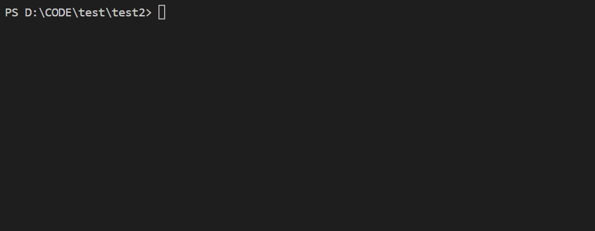

# bilibili-course-download

bilibili视频命令行下载工具，根据油猴插件修改：https://greasyfork.org/zh-CN/scripts/390952

## 使用

```shell
npm install -g bilibili-course-download
bilibili-course-download -u https://www.bilibili.com/video/BV1oA411H7Rc?p=19
```

## 参数

|参数|必选|默认值| 示例 | 含义 |
| -- | -- | -- | -- | -- |
| -u, -uri | 否 | null | https://www.bilibili.com/video/BV1oA411H7Rc?p=19 | ilibili视频网址 |
| -r, -range | 否 | null | 1,30 | 下载集数范围 |
| -o, -output | 否 | dist | video | 输出文件夹 |

**以上参数也可以不传，不传时，将会在程序运行中请求输入，主要兼容命令行中特殊字符**

